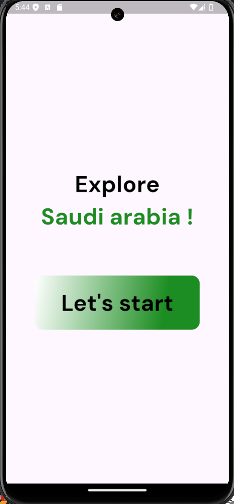
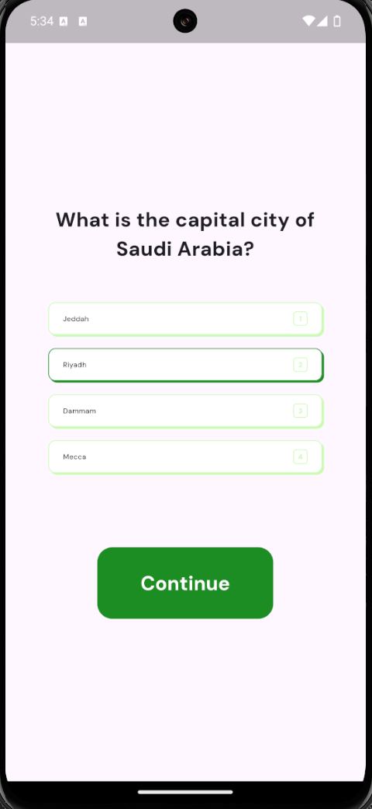
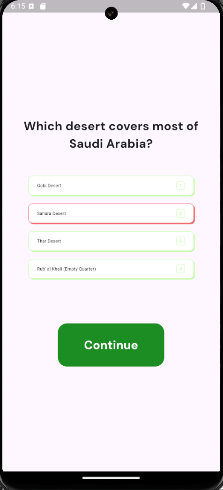

# National Day Assignment 🇸🇦🫡

### Overview 📖

We celebrate the Saudi National Day by building a flutter quiz application that involves saving user state or level, the quiz is general knowledge about the Kingdom of Saudi Arabia.

### packages used 📚

- get_it : to perform service locator in application, to have global reach to the variables.
- get_storage : to store user data and progress.
- confette : to add a beautiful effect at the end of the quiz.
- google fonts : to get the specified font in design.

### Results ⭐
 
**Home Page**

**Correct answer**

**Wrong answer**

**END**
