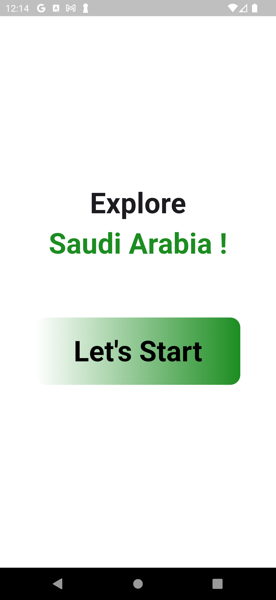
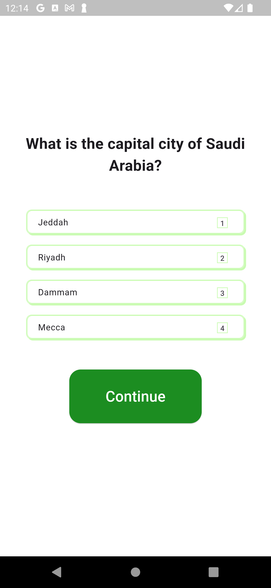
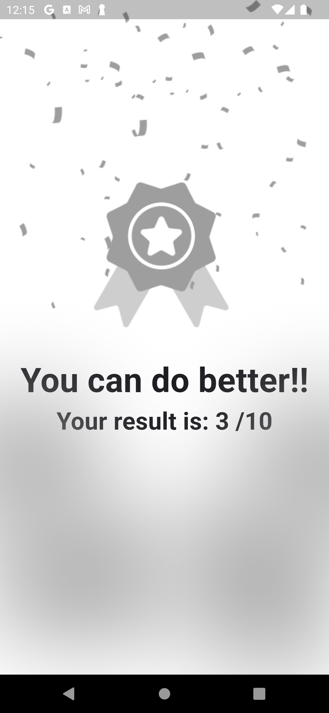

# Saudi National Day Quiz App

## Description

Jeem Store is a Flutter-based shopping application designed to provide a user-friendly and engaging shopping experience. This application features a modern UI and a variety of functionalities to enhance the user experience, including item browsing, favorites management, cart management, and more.

## Features

- Explore Items: Browse through different categories of items like Clothes and Electronics.
- Item Details: View detailed information about each item, including images, ratings, reviews, description, and price.
- Favorites: Add items to your favorites for quick access and to keep track of preferred items.
- Dynamic Image Switching: Toggle between different images of an item to view different colors or variants.
- Responsive Design: The application is designed to be responsive and adapts to various screen sizes.

# Work

## LandingScreen
- This screen is the gate to Jeem Store, it simply allows the user to login or register.
- Flutter Animate package is used here to add a welcoming atmosphere

## Registration and Login Screens
- TextFormFields are used to validate input
- Form widget is used to validate upon submitting

## HomeScreen
- Home Screen shows best sellers, it also contains a Drawer for about and contact sections
- BottomNavigationBar is used to show popular products based on rating

## FavoriteScreen
- This screen is empty at first, but once the user favorites some items, it fills up
- Each user has a favorite List
- Shimmer package is used as a cool feature to show favorite items.

## ExploreScreen
- This page allows the user to pick from two categories to brows with their items
- PageView is used here to show items in each category
- Users can go the item page by tapping on the image, where more details are shown.

## ItemScreen
- This screen displays the item and its details
- User can change color if item is available in different colors
- User can favorite items
- User can add item to cart, cart icon is updated immediately (unless out of stock)

## ProfileScreen
- A simple screen showing User username and email
- Image Picker package is used to allow user to change profile picture

## Helper files
### Utils
- navigation_helper.dart
It presents the AppBar and BottomNavigationBar for all pages that use them.

- blob.dart
Creates a shape that is used in LandingScreen

### Custom Widgets
- AlertMessage, CategoryCard, ItemPageView, LoginTextField

### Packages
- flutter_animate: ^4.5.0
- email_validator: ^3.0.0
- icons_plus: ^5.0.0
- animated_bottom_navigation_bar: ^1.3.3
- shimmer_animation: ^2.2.1
- image_picker: ^1.1.2

--------------------------------------------------
### Future features
- *Showing content of Cart*
- *Password Reset functionality in Profile Screen*
- *Improved UI design*
--------------------------------------------------

- Note: A video of UI is uploaded in assets/video

## Help
If you encounter any issues:
- Make sure you have all the necessary dart files within the project
- Contact us so that we can help resolve the problem

## Authors
Abdulaziz Alamri

## Version History
**See commits history for more details**
- fixed errors and updated README.md
- finished HomeScreen
- finished ProfileScreen
- finisihed ItemScreen, ExploreScreen, FavoriteScreen
- created ItemScreen and class Item, finished UI
- updated Navigation_Screen
- finished register and login UI + landingPage
- created flutter project shopping_app

## Acknowledgments
Tuwaiq Academy

