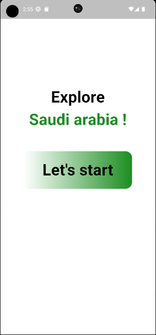
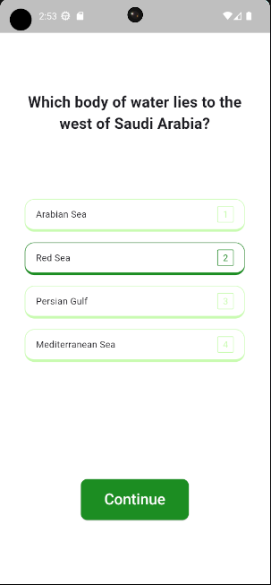
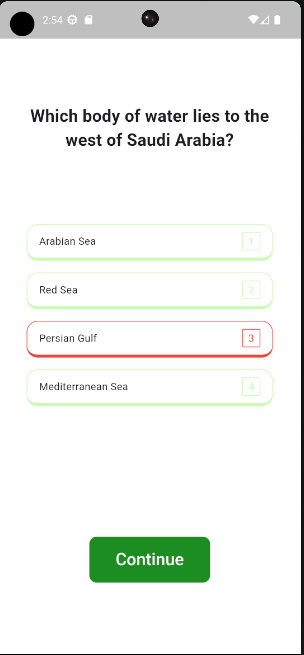
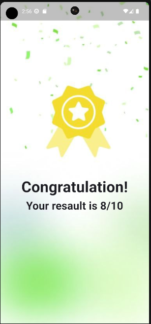
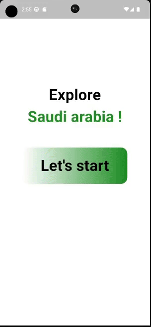

# Quiz App 💡❔️

## Overview

### Purpose
The purpose of this app is to apply a simple quiz to the user about Saudi National Day. 🇸🇦

### Features
- Display Question: Users can answer the question.

- Check Question Answer: Users can know if they chose the wrong or correct answer.

- Local Storage: The app stores and updates the score and level locally.

## Widgets & External Packages

### Main Widgets
- **Container**: The `Container` widget is used to create a rectangular visual element. It can be customized with properties like padding, margin, and decoration.

- **ElevatedButton**: The `ElevatedButton`  widget is used to create a button that elevates when pressed. It is commonly used for actions.

- **InkWell**: The `InkWell`  widget is a material design ripple effect. It responds to touch by displaying a ripple animation. It is often used to wrap other widgets to make them interactive.


### External Packages
- **get_it**: Is a simple Service Locator for Dart and Flutter projects.

- **get_storage**: A fast, extra light and synchronous key-value in memory, which backs up data to disk at each operation. It is written entirely in Dart and easily integrates with Get framework of Flutter.


## Instructions for Running the App

### Prerequisites
- Flutter SDK

### Running the App
1. Clone the repository: 
   ```bash
   git clone https://github.com/Basel-75/national-day-assignment.git
2. Navigate to the project directory: 
   ```bash
   cd national-day-assignment

3. Install dependencies: 
   ```bash
   flutter pub get

4. Run the app on an emulator or connected device: 
   ```bash
   flutter run


## Output

### Screenshot






### Demo GIF



## License

This project is licensed under the MIT License - see the [LICENSE](LICENSE) file for details.

## Contact

For more information, feel free to contact me via basel_1422@outlook.com or visit my GitHub profile @Basel-75.