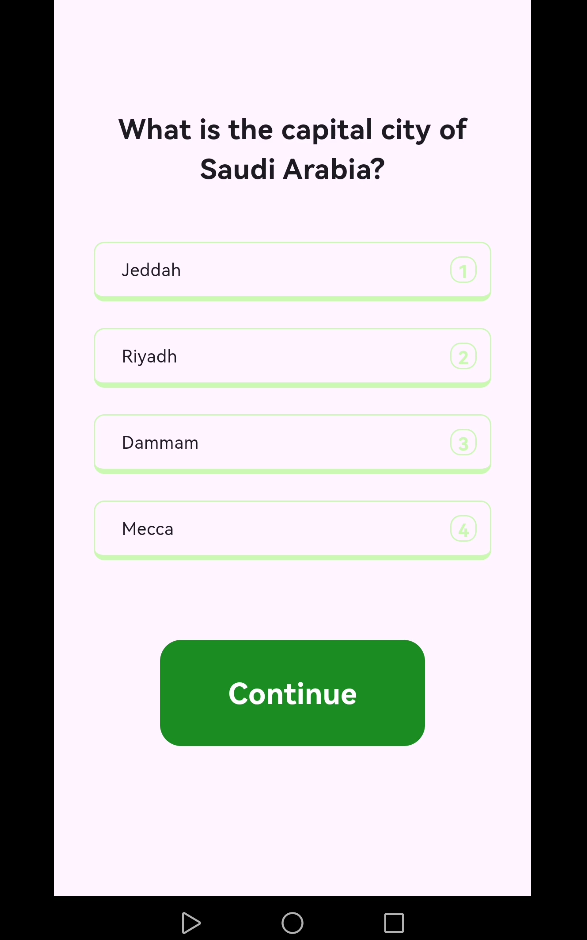
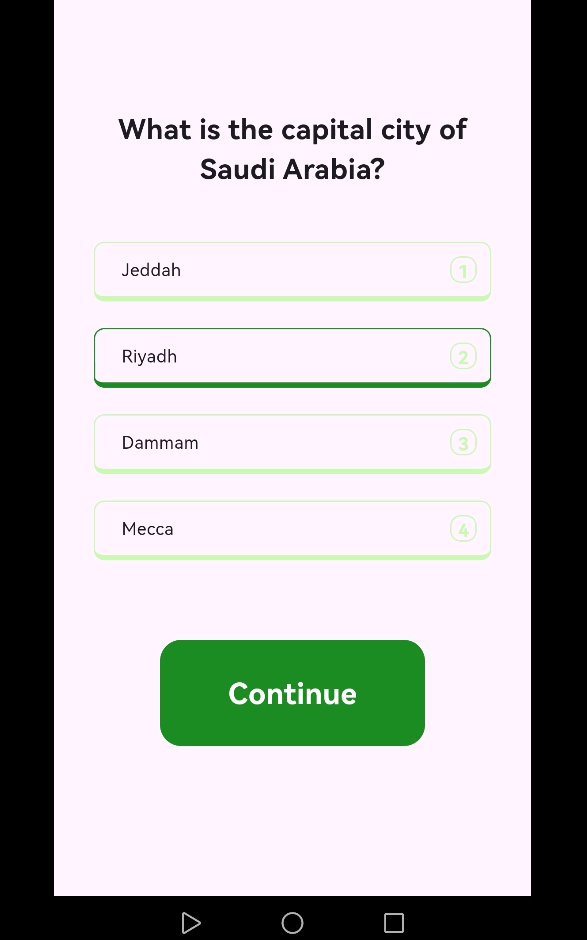
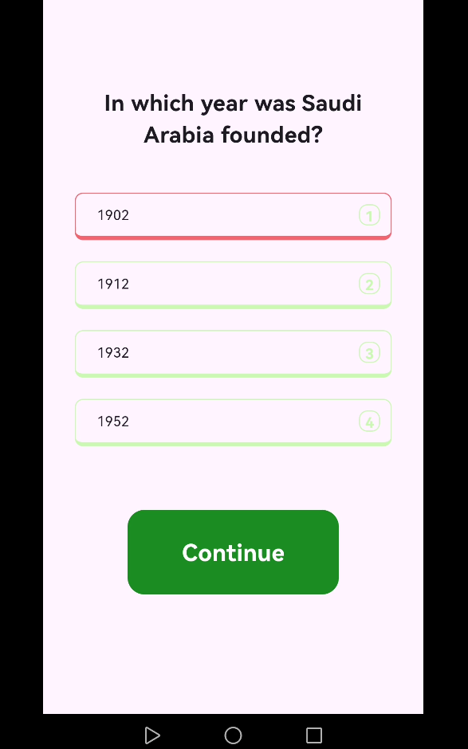

# national_day

the asg done with using git it and getStroge to save what user ans and 
what last page he last been and if he ans the page or not

### page

- HomePage : will show the homepage the page has some logic to check if user has  been taking the test or if yes will push him to it 

- QustPage  : here all qustion will show up the difrent qustion order will show up by varible called curnetQusPage after check that the user chose ans the counter will go up by one to show next page of qustion when user click buuton

    - the user can only chose one ans if he chose ans will not allow him to cheose other ans

-  ResultPage : here will show up the user resutlt and after 5 second the app will remove all getstorge data and reset all the data in the system

---

### widget 

-  ContenuBuutonWidget() : simple widget that show button and can take void function
function have some logic to check if the user ans or not and if this the last page of qustion 

- QustCardWidget() will show up the qustion and  take some value like tex and most imprtent the color that will change depend on some logic that is in appModel 

---

###  AppModel

-  qustList to save the qustion form the json

- userAnsList save user ans to return to it if the user go out 

- curnetQusPage save what last page user has been

- loadData() : will load all the data in the system 

- checkAns() : from the name you know what will do but there is some extra logic to check if this first time check or not if yes will not add it to the userAnsList becuse it just load of the user ans before he leve

- totalAns() : will see how many currct ans user have 

----

### img

