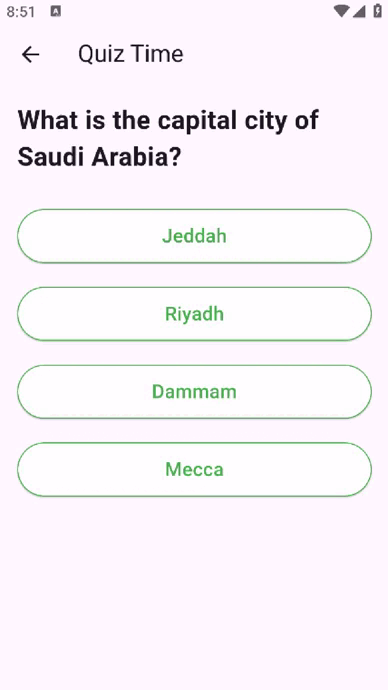

# National Day Quiz App

This is a Flutter-based quiz application that allows users to test their knowledge on various topics. The app presents a series of questions with multiple-choice answers and calculates the user's score based on their responses.

## Features

- Multiple-choice questions on various topics.
- Score calculation based on correct answers.
- User-friendly interface with easy navigation.
- Results screen showing the user's final score.

