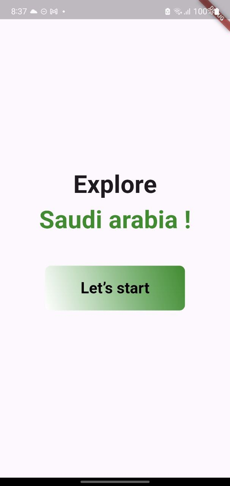

# National day Assignment 🇸🇦

This project involves questions about saudi arabia, allow users to answers various questions.
 

## project Details:

#### -when start if there is score stored the start button will ask user to continue if theres is not, user will stsrt thire quiz
#### -if user choose the correct answer it's color will turn gereen. otherwise it will turn red.
#### -last thing when they done with the quiz thire score will show in result screen.

## project output:

#### - StartScreen:

#### - Correct answer:

#### - wroing answer:

#### - continue:

#### - ResultScreen:

## Author:
Rahaf Alghamdi

